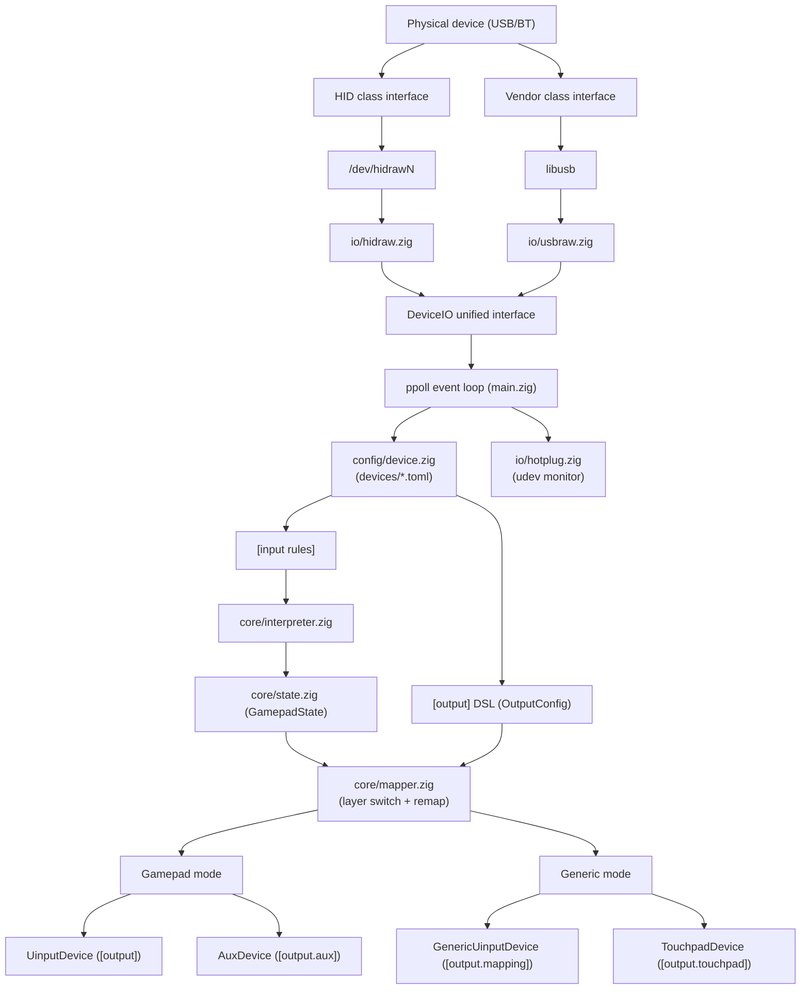

# padctl

**Universal Linux gamepad compatibility layer**


## What is padctl

padctl is a userspace daemon that maps vendor-specific USB/HID gamepad reports to standard Linux input events via uinput. Device support is driven entirely by declarative TOML configs — no kernel patches, no custom drivers.

## Features

- **Declarative device configs** — add new devices with a `.toml` file, no recompilation
- **Layer system** — hold/toggle/tap-hold layers with independent remaps, gyro, and stick modes
- **Gyro mouse** — gyro-to-mouse with sensitivity, deadzone, smoothing, and curve controls
- **Stick mouse/scroll** — left or right stick as mouse or scroll wheel
- **Macros** — named key sequences bound to any button
- **Multi-device + hotplug** — automatic device detection and per-device threads via netlink
- **Hot-reload** — `SIGHUP` re-reads configs without restart, diffed per physical device
- **Force feedback** — FF_RUMBLE passthrough from uinput to physical device

## Architecture (Simplified)



## Supported Devices

Ships with configs for **12 devices** across 8 vendors:

**Sony** (3) · **Nintendo** (1) · **Microsoft** (1) · **Valve** (1) · **8BitDo** (1) · **Flydigi** (2) · **HORI** (1) · **Lenovo** (2)

[Full device list with feature matrix →](https://bananasjim.github.io/padctl/devices/)

## Quick Start

```sh
zig build                                    # build from source
sudo zig-out/bin/padctl install              # install binary, configs, udev rules, systemd service
sudo systemctl enable --now padctl.service   # start daemon with hotplug support
padctl scan                                  # check detected devices
```

See the [getting started guide](https://bananasjim.github.io/padctl/getting-started.html) for detailed setup.

## Build

**Requirements:** Zig 0.15+, libusb-1.0

```sh
zig build              # build all binaries
zig build test         # run unit tests
zig build check-all    # all checks (test + safe + fmt)
```

| Flag | Default | Effect |
|------|---------|--------|
| `-Dlibusb=false` | `true` | Disable libusb linkage (hidraw-only) |
| `-Dwasm=false` | `true` | Disable WASM plugin runtime |

## Documentation

Full documentation: [bananasjim.github.io/padctl](https://bananasjim.github.io/padctl/)

- [Getting started](https://bananasjim.github.io/padctl/getting-started.html)
- [Device config reference](https://bananasjim.github.io/padctl/device-config.html)
- [Mapping config reference](https://bananasjim.github.io/padctl/mapping-config.html)
- [Supported devices](https://bananasjim.github.io/padctl/devices/)

## Contributing

See [CONTRIBUTING.md](CONTRIBUTING.md) for guidelines on adding device configs or contributing code.

## License

LGPL-2.1-or-later — see [LICENSE](LICENSE).
